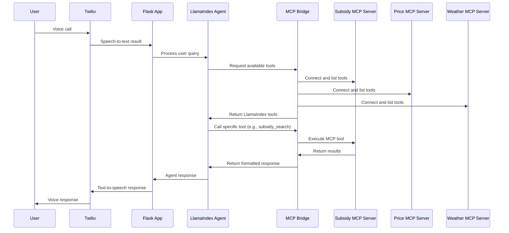

# KissanDial MCP Architecture

## Overview

KissanDial has been refactored to use the Model Context Protocol (MCP) for extensible, standardized access to agricultural data sources. This architecture allows for easy addition of new data sources without modifying core application code.

## Architecture Diagram

```
┌─────────────────┐    ┌─────────────────┐    ┌─────────────────┐
│   Twilio Voice  │    │   Flask Web     │    │   LlamaIndex    │
│   Interface     │───▶│   Application   │───▶│   Agent         │
└─────────────────┘    └─────────────────┘    └─────────────────┘
                                                        │
                                                        ▼
                                               ┌─────────────────┐
                                               │   MCP Bridge    │
                                               │   (Translator)  │
                                               └─────────────────┘
                                                        │
                        ┌───────────────────────────────┼───────────────────────────────┐
                        │                               │                               │
                        ▼                               ▼                               ▼
                ┌─────────────────┐            ┌─────────────────┐            ┌─────────────────┐
                │   Subsidy MCP   │            │   Price MCP     │            │   Weather MCP   │
                │   Server        │            │   Server        │            │   Server        │
                └─────────────────┘            └─────────────────┘            └─────────────────┘
                        │                               │                               │
                        ▼                               ▼                               ▼
                ┌─────────────────┐            ┌─────────────────┐            ┌─────────────────┐
                │   CSV Data      │            │   Mock Market   │            │   Mock Weather  │
                │   (Subsidies)   │            │   Data          │            │   Data/API      │
                └─────────────────┘            └─────────────────┘            └─────────────────┘
```

## Components

### 1. Core Application (`app/agent_mcp.py`)
- **Purpose**: Main Flask application handling Twilio voice interactions
- **Responsibilities**:
  - Voice call routing and processing
  - LlamaIndex agent orchestration
  - SMS functionality
- **MCP Integration**: Uses `load_mcp_tools()` to dynamically load tools from MCP servers

### 2. MCP Bridge (`tools/mcp_bridge.py`)
- **Purpose**: Translator between MCP servers and LlamaIndex tools
- **Responsibilities**:
  - Connect to MCP servers via stdio
  - Convert MCP tools to LlamaIndex FunctionTool objects
  - Handle async/sync compatibility
- **Key Functions**:
  - `connect_stdio_server()`: Establish connection to MCP server
  - `load_tools_from_server()`: Extract tools from connected server
  - `load_mcp_tools()`: Main entry point for LlamaIndex integration

### 3. MCP Servers

#### Subsidy Server (`servers/subsidy_mcp.py`)
- **Data Source**: CSV files in `data/subsidies/central/`
- **Tools Provided**:
  - `subsidy_search`: Search subsidies by query
  - `get_subsidy_categories`: List available categories
  - `get_subsidy_by_state`: Filter subsidies by state
- **Transport**: stdio

#### Price Server (`servers/price_mcp.py`)
- **Data Source**: Mock market data (can be replaced with real API)
- **Tools Provided**:
  - `get_mandi_price`: Current crop prices
  - `get_price_trends`: 30-day price trends
  - `compare_crop_prices`: Compare multiple crops
  - `get_available_crops`: List supported crops
  - `get_available_districts`: List supported districts
- **Transport**: stdio

#### Weather Server (`servers/community/weather_mcp.py`)
- **Data Source**: Mock weather data (can be replaced with real weather API)
- **Tools Provided**:
  - `get_current_weather`: Current weather conditions
  - `get_weather_forecast`: Multi-day forecast
  - `get_agricultural_weather_alert`: Agriculture-specific alerts
  - `get_rainfall_data`: Rainfall predictions and history
- **Transport**: stdio

## Data Flow Sequence



## Adding a New Data Source in 6 Steps

### Step 1: Create MCP Server
```python
# servers/new_data_mcp.py
from mcp.server import Server
from mcp.server.stdio import stdio_server
from mcp.types import Tool, TextContent

class NewDataMCPServer:
    def __init__(self):
        self.server = Server("new-data-server")
        self.setup_handlers()
    
    def setup_handlers(self):
        @self.server.list_tools()
        async def handle_list_tools() -> list[Tool]:
            return [
                Tool(
                    name="get_new_data",
                    description="Get new agricultural data",
                    inputSchema={
                        "type": "object",
                        "properties": {
                            "query": {"type": "string"}
                        },
                        "required": ["query"]
                    }
                )
            ]
        
        @self.server.call_tool()
        async def handle_call_tool(name: str, arguments: dict | None):
            # Implement your data retrieval logic here
            return [TextContent(type="text", text="Your data here")]
```

### Step 2: Update MCP Bridge Configuration
```python
# In tools/mcp_bridge.py, add to server_configs:
"new_data": str(project_root / "servers" / "new_data_mcp.py"),
```

### Step 3: Update Environment Configuration
```bash
# In .env file, add to MCP_SERVERS:
MCP_SERVERS=stdio:./servers/subsidy_mcp.py,stdio:./servers/price_mcp.py,stdio:./servers/new_data_mcp.py
```

### Step 4: Add API Keys (if needed)
```bash
# In .env file:
NEW_DATA_API_KEY=your_api_key_here
```

### Step 5: Update Docker Compose (for production)
```yaml
# In docker-compose.yml:
new-data-server:
  build:
    context: .
    dockerfile: Dockerfile.mcp
  command: python servers/new_data_mcp.py
  environment:
    - NEW_DATA_API_KEY=${NEW_DATA_API_KEY}
```

### Step 6: Test and Deploy
```bash
# Test the server
python servers/new_data_mcp.py

# Test integration
python tools/mcp_bridge.py

# Run full application
python app/agent_mcp.py
```

## Configuration

### Environment Variables

| Variable | Description | Required | Default |
|----------|-------------|----------|---------|
| `OPENAI_API_KEY` | OpenAI API key for LLM | Yes | - |
| `TWILIO_ACCOUNT_SID` | Twilio account identifier | Yes | - |
| `TWILIO_AUTH_TOKEN` | Twilio authentication token | Yes | - |
| `MCP_SERVERS` | Comma-separated list of MCP servers | No | Default servers |
| `WEATHER_API_KEY` | Weather service API key | No | Mock data |
| `MARKET_API_KEY` | Market data API key | No | Mock data |

### MCP Server Configuration Format
```
MCP_SERVERS=transport:path_or_url,transport:path_or_url,...

Examples:
- stdio:./servers/subsidy_mcp.py
- sse:http://localhost:8001
- websocket:ws://localhost:8002
```

## Deployment

### Development
```bash
# Activate virtual environment
source venv/bin/activate

# Run with MCP support
python app/agent_mcp.py
```

### Production (Docker)
```bash
# Copy environment file
cp .env.example .env
# Edit .env with real values

# Start all services
docker-compose up -d

# View logs
docker-compose logs -f kissandial-app
```

## Monitoring and Health Checks

### Health Check Endpoints
- Main app: `GET /health` (to be implemented)
- Individual MCP servers: Built-in health checks in Docker

### Logging
- Application logs: Console output with timestamps
- MCP server logs: stderr output
- Error tracking: Exception handling with context

## Security Considerations

1. **API Keys**: Store in environment variables, never in code
2. **Input Validation**: All MCP tools validate input parameters
3. **Rate Limiting**: Implement for external API calls
4. **Access Control**: Use non-root users in Docker containers
5. **Network Security**: Use internal Docker networks for MCP communication

## Performance Optimization

1. **Connection Pooling**: Reuse MCP server connections
2. **Caching**: Implement Redis for frequently accessed data
3. **Async Operations**: Use async/await for I/O operations
4. **Health Monitoring**: Automatic restart of failed MCP servers

## Troubleshooting

### Common Issues

1. **MCP Server Connection Failed**
   - Check server path in configuration
   - Verify Python environment and dependencies
   - Check server logs for startup errors

2. **Tool Not Available**
   - Verify MCP server is running
   - Check tool name in server implementation
   - Validate input schema matches requirements

3. **Async/Sync Compatibility Issues**
   - MCP Bridge handles this automatically
   - Check for proper async/await usage in custom servers

### Debug Commands
```bash
# Test individual MCP server
python servers/subsidy_mcp.py

# Test MCP bridge
python tools/mcp_bridge.py

# Test full integration
python test_mcp.py
```

## Future Enhancements

1. **Real API Integration**: Replace mock data with real agricultural APIs
2. **Caching Layer**: Add Redis for improved performance
3. **Monitoring Dashboard**: Web interface for MCP server status
4. **Auto-scaling**: Dynamic MCP server scaling based on load
5. **Plugin System**: Hot-reload capability for new MCP servers
6. **Data Validation**: Schema validation for all data sources
7. **Analytics**: Usage tracking and performance metrics

## Contributing

1. Follow the 6-step process for adding new data sources
2. Write tests for new MCP servers
3. Update documentation for new tools
4. Follow async/await patterns for I/O operations
5. Implement proper error handling and logging
